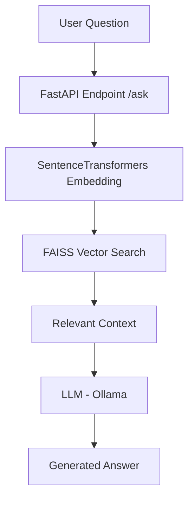

## Architecture

```mermaid
graph TD
A[User Question] --> B[FastAPI Endpoint /ask]
B --> C[SentenceTransformers Embedding]
C --> D[FAISS Vector Search]
D --> E[Relevant Context]
E --> F[LLM - Ollama]
F --> G[Generated Answer]
```
## Security

This project runs fully locally using Ollama and open-source embedding models.
No external APIs or credentials are required.
